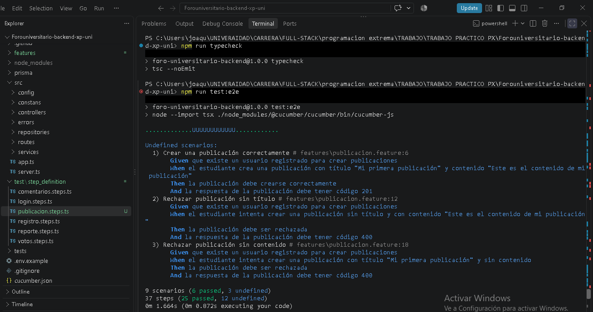
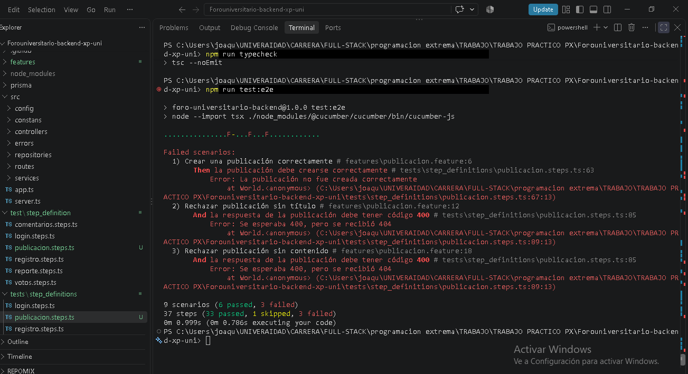
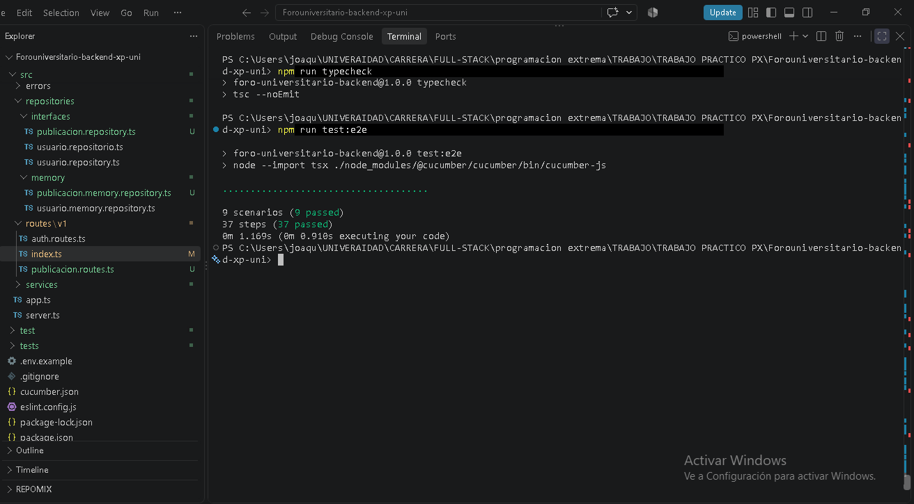
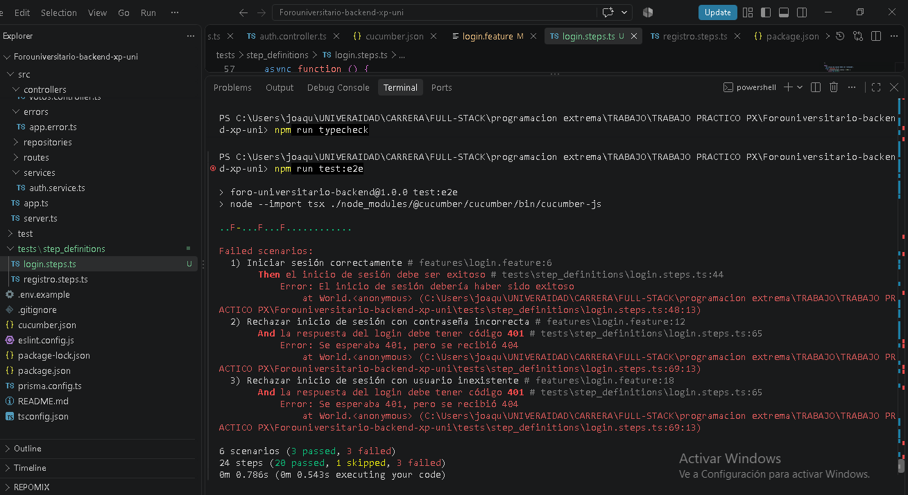
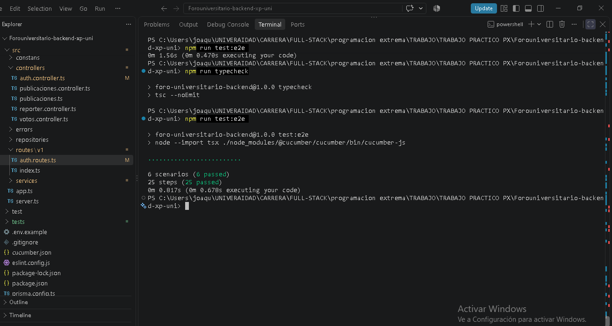
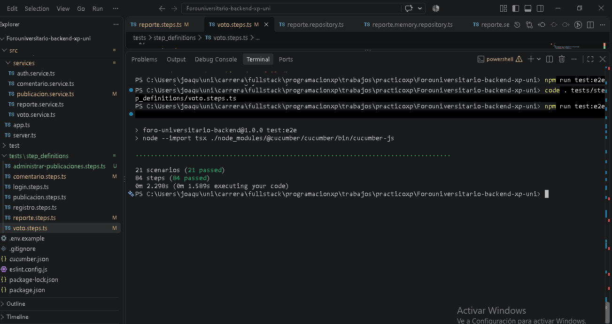

# Foro Universitario - Backend

Backend de un foro para estudiantes, API REST con TypeScript y Express donde se puede registrarse, iniciar sesión, publicar, comentar, votar y reportar publicaciones. Un administrador puede eliminar las publicaciones reportadas.

Cada funcionalidad se escribió primero como escenario de Cucumber (BDD), se vio fallar, se programó lo mínimo para que pasara y después se limpió el código. Con capturas de proceso.

## Tecnologías

Node.js 22, TypeScript, Express 5, bcrypt, jsonwebtoken, Cucumber con Supertest para las pruebas, ESLint y GitHub Actions. Prisma está instalado pero todavía no se usa.

## Ejecución

Hace falta Node.js 22 o superior.

```bash
git clone <URL_DEL_REPOSITORIO>
cd Forouniversitario-backend-xp-uni
npm install
```

Copiar `.env.example` a `.env`. Las variables que usa hoy el proyecto son `PORT` (por defecto 3000) y `JWT_SECRET`. `DATABASE_URL` queda para cuando se conecte la base de datos.

```bash
npm run dev
```

El servidor queda en `http://localhost:3000`, con todas las rutas bajo `/api/v1`.

Otros comandos:

```bash
npm run test:e2e     # escenarios de Cucumber
npm run typecheck    # chequeo de tipos
npm run lint         # ESLint
npm run build        # compila a dist/
npm start            # corre lo compilado
```

La prueba del hash de contraseñas (HT-01) es un script aparte:

```bash
npx tsx tests/auth.service.security.test.ts
```

## Endpoints

| Método | Ruta | Body | Respuestas |
| --- | --- | --- | --- |
| POST | `/auth/registro` | nombre, correo, password | 201, 400, 409 si el correo ya existe |
| POST | `/auth/login` | correo, password | 200 con token, 400, 401 |
| POST | `/publicaciones` | titulo, contenido | 201, 400 |
| DELETE | `/publicaciones/:publicacionId` | | 204, 400, 404 |
| POST | `/publicaciones/:publicacionId/comentarios` | contenido | 201, 400, 404 |
| POST | `/publicaciones/:publicacionId/votos` | tipo | 201, 400, 404 |
| POST | `/publicaciones/:publicacionId/reportes` | motivo | 201, 400, 404 |

Los errores vuelven como `{ "error": "mensaje" }`. Un ejemplo con curl:

```bash
curl -X POST http://localhost:3000/api/v1/auth/registro \
  -H "Content-Type: application/json" \
  -d '{"nombre":"Juan","correo":"juan@universidad.com","password":"123456"}'
```

## Estructura

```text
src/
  routes/v1/       rutas y armado de dependencias
  controllers/     leen el request y devuelven la respuesta HTTP
  services/        reglas de negocio
  repositories/
    interfaces/    contratos de acceso a datos
    memory/        implementación en memoria
  errors/          AppError (mensaje + código HTTP)
  app.ts           configuración de Express
  server.ts        arranque del servidor
features/          escenarios .feature
tests/             pasos de Cucumber y prueba de seguridad
registro/          capturas del ciclo rojo / verde
```

Una petición pasa por ruta, controlador, servicio y repositorio. Los servicios usan las interfaces de los repositorios y no la implementación, así que cambiar la memoria por una base de datos se hace escribiendo repositorios nuevos, sin tocar servicios ni controladores. Los servicios lanzan `AppError` cuando algo no cumple una regla (publicación inexistente, correo repetido) y el controlador lo convierte en la respuesta HTTP.

## Historias de usuario

- HU-01: registro de usuario
- HU-02: inicio de sesión
- HU-03: crear publicación
- HU-04: comentar una publicación
- HU-05: votar una publicación
- HU-06: reportar una publicación
- HU-07: eliminar una publicación reportada (administrador)
- HT-01: guardar las contraseñas con hash (bcrypt)
- HT-02: integración continua con GitHub Actions

Cada una tiene su archivo en `features/` con un caso exitoso y casos de error. En total son 21 escenarios y 84 pasos.

## Cómo se trabajó

Se siguió el ciclo rojo, verde, refactor. Primero se escribe el escenario y se corre para verlo fallar, después se agrega el código justo para que pase y por último se ordena. Cada historia sumó tres escenarios: de 9 escenarios en HU-03 se llegó a 21 en HU-07.

### Ejemplo: HU-03, crear publicación

Primero el escenario existe pero sus pasos todavía no están definidos:



Con los pasos escritos, las pruebas fallan porque la ruta no existe (esperaban 400 y recibieron 404):



Después de implementar la ruta, el servicio y el repositorio, pasan los 9 escenarios:



### Ejemplo: HU-02, inicio de sesión

Antes de implementar el login, tres escenarios fallan:



Con el login hecho pasan los 6 escenarios de registro y login:



### HT-01, contraseñas con hash

La prueba registra un usuario y comprueba que lo guardado no sea la contraseña original y que `bcrypt.compare` la reconozca:


### Resultado final

Con HU-07 terminada pasan los 21 escenarios:



## Prácticas de XP aplicadas

- BDD: cada historia está escrita en Gherkin ("Como... Quiero... Para...") dentro de `features/`, antes de programarla.
- TDD: el ciclo rojo, verde, refactor descrito arriba, con las capturas como evidencia.
- Diseño simple: solo se programó lo que pedía cada historia. Por ejemplo, el voto todavía no valida el tipo ni evita votos repetidos porque ninguna historia lo pide.
- Refactorización: con las pruebas en verde se ordenó el código. Un ejemplo es que el repositorio de publicaciones se arma una sola vez en `routes/v1/dependencies.ts` y lo comparten las rutas.
- Integración continua: cada push o Pull Request a `main` corre las validaciones en GitHub Actions.

## Decisiones de diseño

- Los repositorios son en memoria para no depender de una base de datos en las primeras iteraciones. Como los servicios usan interfaces, después se pueden reemplazar por repositorios con Prisma.
- Las contraseñas se guardan con bcrypt y nunca se devuelven en las respuestas.
- El login responde igual (401) si el correo no existe o si la contraseña es incorrecta, para no revelar qué usuarios están registrados.
- Las rutas están bajo `/api/v1` para poder cambiar la API más adelante sin romper a quien ya la use.
- Las pruebas llaman a la API completa con Supertest, así validan lo que realmente ve el cliente y no clases sueltas.

## Integración continua

El workflow `.github/workflows/main.yml` corre con cada push a `main` y con cada Pull Request hacia `main`. Usa Node 22 y ejecuta en orden `npm ci`, `npm run lint`, `npm run build` y `npm run test:e2e`.
